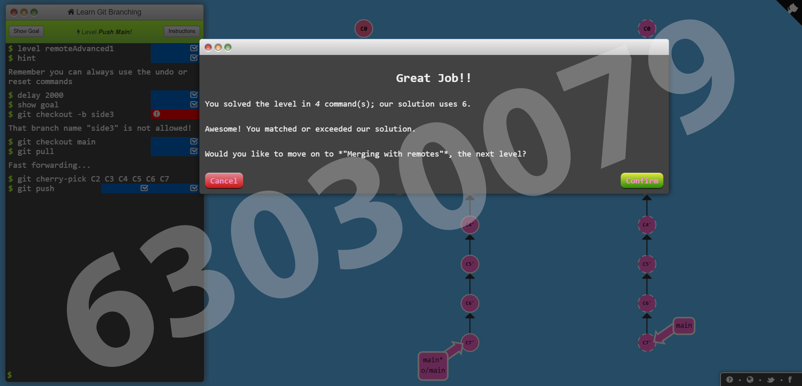
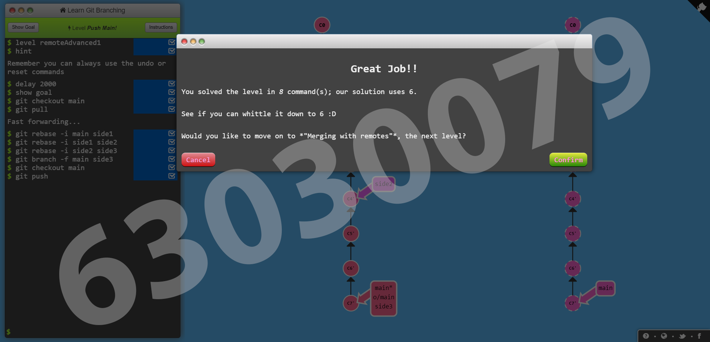
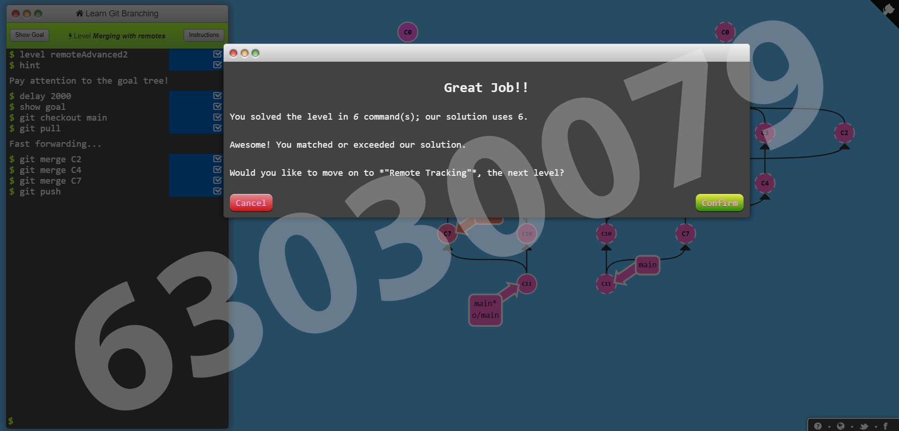
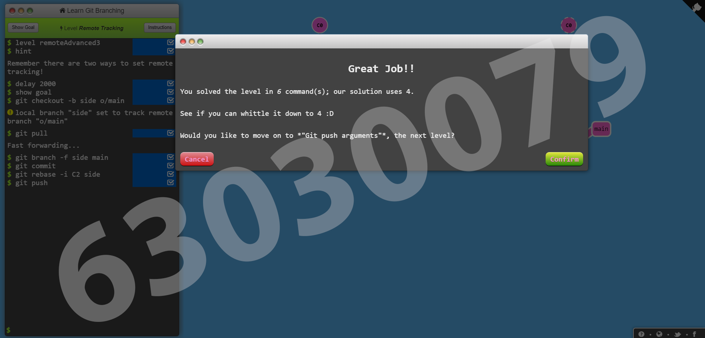
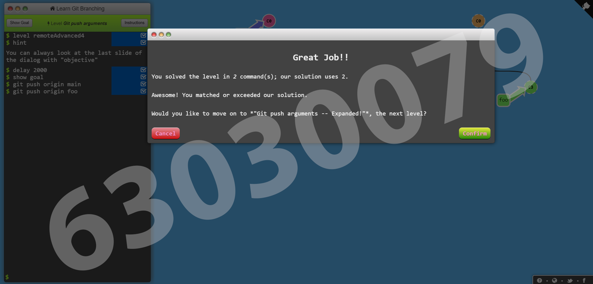
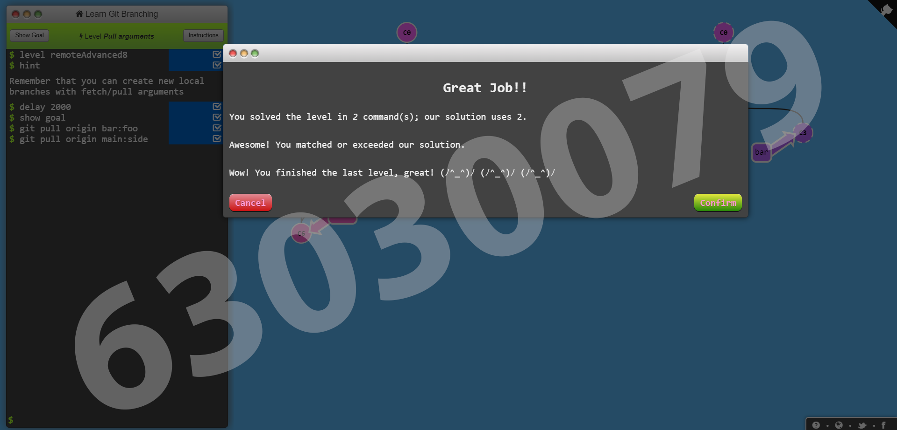
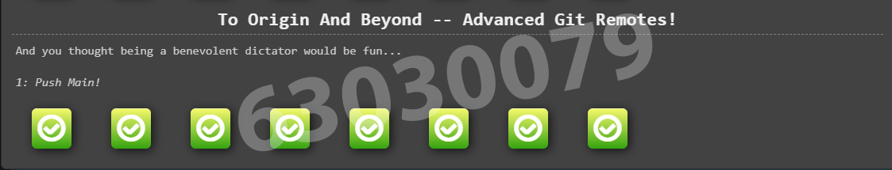

# Week 13 #

## ใบงาน

ให้ฝึกทำการ branching  จาก  https://learngitbranching.js.org/ แล้ว capture ผลลัพธ์ส่งใน pull request

## ผลการเล่นเกมส์

ด่านที่ 2.1 

---

ด่านที่ 2.2

---

ด่านที่ 2.3

---

ด่านที่ 2.4

---

ด่านที่ 2.5

---

ด่านที่ 2.6

---

ด่านที่ 2.7

---

ด่านที่ 2.8

---

ตารางสรุปผล

---
